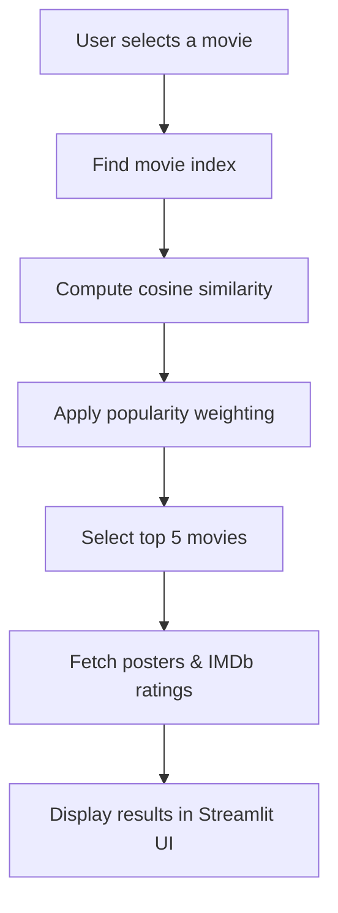

# 🎬 Bollywood Movie Recommendation System

A **Bollywood Movie Recommendation System** built using **content-based filtering**, enhanced with **popularity-aware ranking**, and deployed using **Streamlit Cloud**.  
The application dynamically displays **IMDb movie posters and ratings** using the **OMDb API** and provides an explainable, interactive user interface.

---

## 🔗 Live Demo
👉 **Live App**: https://bollywood-movie-recommendation-system.streamlit.app/

👉 **GitHub Repo**: https://github.com/pranayk15/Bollywood-Movie-Recommendation-System

---

## 🚀 Features

- 🎥 Bollywood-only movie recommendations  
- 🧠 Content-based filtering using TF-IDF  
- ⭐ Popularity-aware ranking to avoid outdated movies  
- 🖼️ IMDb posters & ratings via OMDb API  
- 🌙 Netflix-style dark UI  
- 🖱️ Hover animations and fixed-size movie cards  
- 📊 Explainable sidebar describing model logic  
- ☁️ Deployed on Streamlit Cloud  

---

## 🧠 How the Recommendation Model Works

### 🔹 Model Type
**Content-Based Recommendation System**

The model recommends movies based on similarity in content rather than user behavior.

---

### 🔹 Features Used
- Movie overview  
- Genre  
- Director  
- Cast  
- Release year (used as popularity signal)

---

### 🔹 Text Vectorization
- TF-IDF Vectorizer  
- Removes common stopwords  
- Highlights important descriptive words  

**Key Parameters**
```
max_features = 8000
stop_words = "english"
```

---

### 🔹 Similarity Metric
- Cosine Similarity  
- Measures similarity between movie vectors  
- Score range: 0 (no similarity) to 1 (very similar)

---

### 🔹 Final Scoring Strategy
```
Final Score =
0.7 × Content Similarity
+ 0.3 × Popularity Score
```

- Content similarity ensures relevance  
- Popularity score reduces very old or obscure recommendations  

---

## 📐 System Architecture

### Recommendation Flow


---


---

## 🖼️ Poster & Rating Handling

- Posters and ratings are fetched using the **OMDb API**
- Some less popular or older movies may not have posters available
- A placeholder image is displayed when posters are unavailable
- API responses are cached to improve performance and avoid rate limits

---

## 🛠️ Tech Stack

| Layer | Technology |
|------|-----------|
Backend | Python |
ML | TF-IDF, Cosine Similarity (scikit-learn) |
Data Processing | Pandas |
UI | Streamlit |
Posters & Ratings | OMDb API |
Deployment | Streamlit Cloud |
Persistence | Pickle |

---

## 📂 Project Structure
```
Bollywood-Movie-Recommendation-System/
│── streamlit.py
│── bollywood_movies.pkl
│── bollywood_similarity.pkl
│── requirements.txt
│── README.md
```

---

## ⚙️ Installation & Local Run

```bash
git clone https://github.com/pranayk15/Bollywood-Movie-Recommender-System.git
cd Bollywood-Movie-Recommender-System
pip install -r requirements.txt
streamlit run streamlit.py
```

---

## 🔐 Environment Variables
```
OMDB_API_KEY=your_omdb_api_key
```

---

## 🙌 Acknowledgements

- OMDb API for movie posters and ratings

- Streamlit for rapid UI development

- IMDb metadata sources

---

## 👤 Author
Pranay Kale

