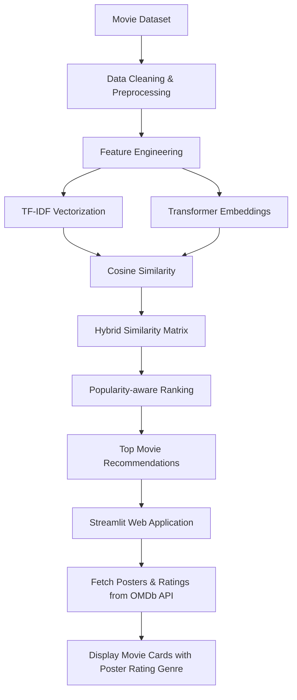
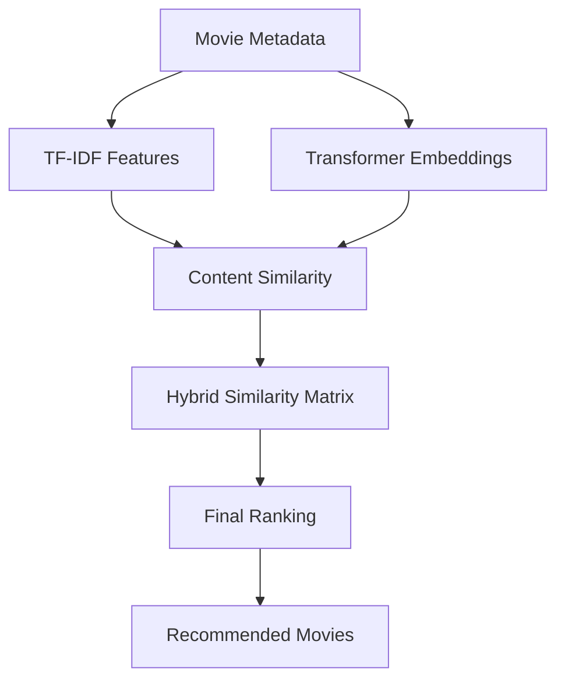

# 🎬 Bollywood Movie Recommendation System

A **Hybrid Content-Based Movie Recommender** that suggests similar Bollywood movies using metadata such as genre, cast, director, and movie overview.

The system combines **TF-IDF vectorization and Transformer embeddings** to capture both keyword-level and semantic similarity, and ranks results using a **popularity-aware scoring strategy**.

Built with **Python, Scikit-learn, SentenceTransformers, and Streamlit**, the application also integrates **IMDb posters and ratings via the OMDb API** to provide an interactive user experience.

---

# 🚀 Live Demo

Streamlit App
👉 https://bollywood-movie-recommendation-system.streamlit.app/

---

# ✨ Features

✔ Hybrid recommendation system (TF-IDF + Transformer embeddings)
✔ Popularity-aware ranking to avoid outdated movies
✔ IMDb poster and rating integration using OMDb API
✔ Interactive **Netflix-style UI** built with Streamlit
✔ Automatic model download from Google Drive
✔ Fast recommendations using a **precomputed similarity matrix**

---

# 🏗️ System Architecture


```mermaid
flowchart TD
    A[Movie Dataset] --> B[Data Cleaning & Preprocessing]

    B --> C[Feature Engineering]
    C --> D[TF-IDF Vectorization]
    C --> E[Transformer Embeddings]

    D --> F[Cosine Similarity]
    E --> F

    F --> G[Hybrid Similarity Matrix]

    G --> H[Popularity-aware Ranking]

    H --> I[Top Movie Recommendations]

    I --> J[Streamlit Web Application]

    J --> K[Fetch Posters & Ratings from OMDb API]

    K --> L[Display Movie Cards with Poster Rating Genre]
```

---

# ⚙️ Recommendation Workflow


```mermaid
flowchart LR
    A[User selects a movie] --> B[Find movie index]

    B --> C[Retrieve similarity scores]

    C --> D[Compute Final Score]

    D --> E[0.7 Content Similarity]
    D --> F[0.3 Popularity Score]

    E --> G[Rank Movies]
    F --> G

    G --> H[Select Top 5 Movies]

    H --> I[Fetch Poster & IMDb Rating]

    I --> J[Display Recommendations in Streamlit UI]
```

---

# 🧠 Recommendation Model

The system combines **two similarity representations** to capture richer movie relationships.


```mermaid
graph TD
    A[Movie Metadata] --> B[TF-IDF Features]
    A --> C[Transformer Embeddings]

    B --> D[Content Similarity]
    C --> D

    D --> E[Hybrid Similarity Matrix]

    E --> F[Final Ranking]

    F --> G[Recommended Movies]
```

---

# 🔍 Features Used

The model uses the following movie metadata:

* Movie **overview**
* **Genre**
* **Director**
* **Cast**
* **Release year** (for popularity bias)

---

# 🧠 Text Representation

Two techniques are combined to capture both lexical and semantic similarity.

### TF-IDF Vectorization

Captures important keywords in movie descriptions.

### Transformer Embeddings

Captures semantic meaning of text using contextual representations.

### Hybrid Similarity

```
Hybrid Similarity =
0.6 × TF-IDF Similarity
+
0.4 × Transformer Similarity
```

---

# ⭐ Final Ranking Strategy

```
Final Score =
0.7 × Content Similarity
+
0.3 × Popularity Score
```

This ensures recommendations are:

* relevant
* contextually similar
* not extremely old or obscure

---

# 🖼️ Poster & Rating Integration

Movie posters and ratings are fetched using the **OMDb API**.

Displayed information includes:

* 🎬 Movie poster
* ⭐ IMDb rating
* 📅 Release year
* 🎭 Genre

If a poster is unavailable, a **placeholder image** is displayed.

---

# 🛠️ Tech Stack

| Category         | Tools                |
| ---------------- | -------------------- |
| Programming      | Python               |
| Data Processing  | Pandas, NumPy        |
| Machine Learning | Scikit-learn         |
| Embeddings       | SentenceTransformers |
| Web Application  | Streamlit            |
| API Integration  | OMDb API             |
| Model Storage    | Pickle               |
| Model Download   | gdown                |

---

# 📂 Project Structure

```
Bollywood-Movie-Recommendation-System
│
├── streamlit.py
├── train_model.py
├── movies_metadata.pkl
├── requirements.txt
├── README.md
└── .gitignore
```

The similarity matrix is **not stored in the repository** due to GitHub file size limits.
It is automatically downloaded from **Google Drive** when the application runs.

---

# ⚙️ Installation

Clone the repository

```
git clone https://github.com/pranayk15/Bollywood-Movie-Recommendation-System.git
```

Navigate to the project directory

```
cd Bollywood-Movie-Recommendation-System
```

Install dependencies

```
pip install -r requirements.txt
```

Run the application

```
streamlit run streamlit.py
```

---

# 🎬 How to Use

1️⃣ Select a movie from the dropdown menu
2️⃣ Click **Recommend**
3️⃣ The system will display **5 similar Bollywood movies**

Each recommendation includes:

* Poster
* IMDb rating
* Release year
* Genre

---

# ⚠️ Limitations

* Some movies may not have posters available in IMDb.
* Recommendations depend on **metadata similarity**, not personal user preferences.
* Recommendation quality depends on the **dataset coverage and quality**.

---

# 🔮 Future Improvements

Potential enhancements for the system:

* Collaborative filtering using user ratings
* Personalized recommendations
* LLM-based movie embeddings
* Improved ranking using popularity metrics
* Explainable recommendations

---

# 👨‍💻 Author

**Pranay Kale**

GitHub
https://github.com/pranayk15

---

# 📜 License

This project is licensed under the **MIT License**.
